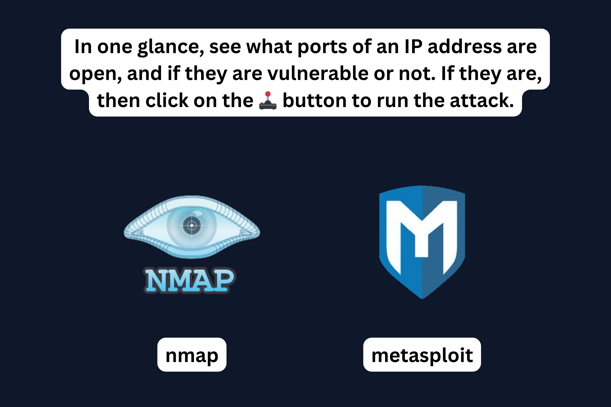
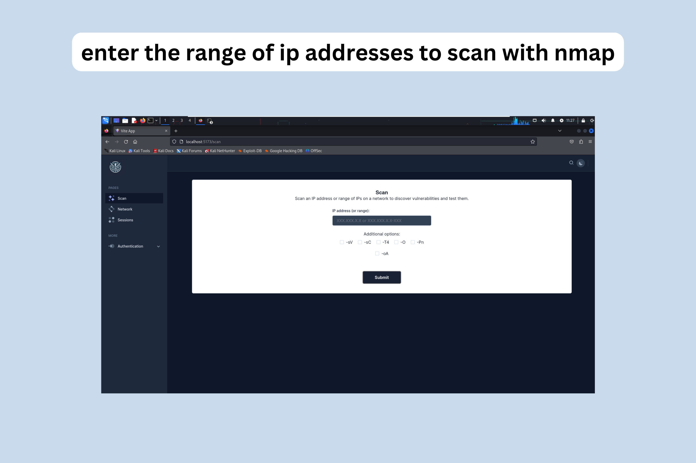
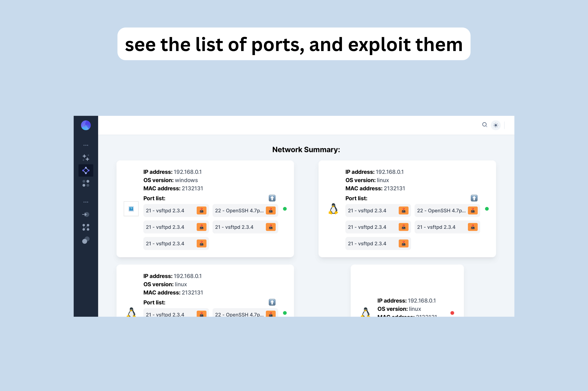
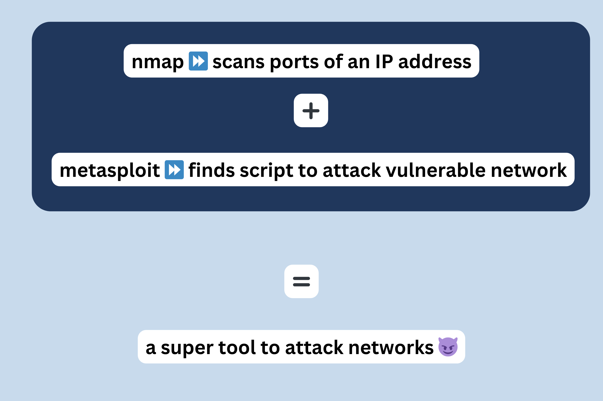

# McHacks2024

## Inspiration

As cybersecurity enthusiasts, we are taking one for the team by breaking the curse of CLIs. 

`Appealing UI for tools like nmap` + `Implementation of Metasploitable scripts` = `happy hacker`

## What it does

In one glance, see what ports of an IP address are open, and if they are vulnerable or not. If they are, then click on the 🕹️ button to run the attack.

nmap is a cybersecurity tool that scans ports of an ip on a network, and retrives the service that is running on each of them, as well as the version. Metasploitable is another tool that is able to run attacks on specified ip and ports to gain access to a machine.

Our app creates a graphical user interface for the use of both tools: it first scans an IP adress with nmap, and then retrieves the attack script from Metasploitable that matches the version of the service to use it.

## How we built it

    ⚛️ React for the front-end
    🐍 Python fastapi for the backend and the metasploitable msfrpc deamon
    🌐 nmap and 🪳 Metasploitable
    📚 SQL for the database
